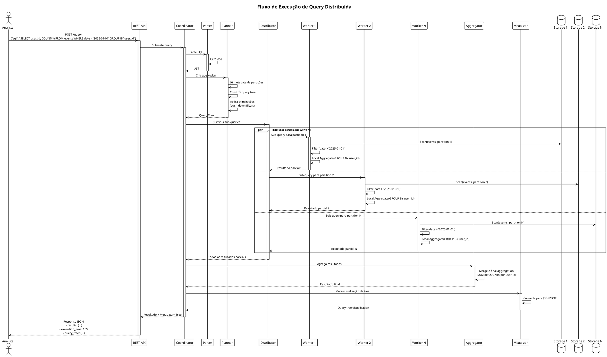
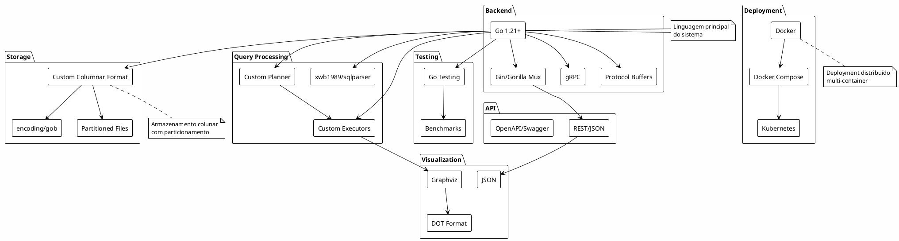

# Diagramas Arquiteturais C4 - Distributed Query Processing

Este documento contém os diagramas arquiteturais do sistema de processamento distribuído de queries inspirado no Google Dremel.

## Como visualizar os diagramas

Os diagramas utilizam PlantUML com extensão C4. Você pode visualizá-los de várias formas:

1. **Online**: Copie o código e cole em https://www.plantuml.com/plantuml/uml/
2. **VS Code**: Instale a extensão "PlantUML" e visualize os diagramas diretamente
3. **CLI**: Use `plantuml` para gerar imagens PNG/SVG

---

## 1. Diagrama de Contexto (Nível 1)

Visão geral do sistema e seus atores externos.

```plantuml
@startuml C4_Context
!include https://raw.githubusercontent.com/plantuml-stdlib/C4-PlantUML/master/C4_Context.puml

LAYOUT_WITH_LEGEND()

title Diagrama de Contexto - Sistema de Distributed Query Processing

Person(analista, "Analista de Dados", "Usuário que submete queries SQL para análise de grandes volumes de dados")
Person(admin, "Administrador", "Gerencia workers, monitora performance e carrega dados")

System(dqp_system, "Distributed Query Processing System", "Sistema distribuído de processamento de queries SQL em dados colunares, inspirado no Google Dremel")

System_Ext(storage_ext, "Data Storage", "Armazenamento distribuído de dados em formato colunar particionado")
System_Ext(monitoring, "Monitoring & Metrics", "Sistema de monitoramento e métricas (Prometheus, Grafana)")
System_Ext(viz_tools, "Graphviz", "Ferramenta externa para renderização de query trees")

Rel(analista, dqp_system, "Submete queries SQL via API REST", "HTTPS/JSON")
Rel(admin, dqp_system, "Gerencia workers, carrega dados, monitora health", "HTTPS/JSON, CLI")
Rel(dqp_system, storage_ext, "Lê/escreve dados particionados", "Columnar Format")
Rel(dqp_system, monitoring, "Envia métricas de execução", "HTTPS")
Rel(dqp_system, viz_tools, "Gera query tree visualization", "DOT format")

@enduml
```

---

## 2. Diagrama de Container (Nível 2)

Principais componentes técnicos do sistema.

```plantuml
@startuml C4_Container
!include https://raw.githubusercontent.com/plantuml-stdlib/C4-PlantUML/master/C4_Container.puml

LAYOUT_TOP_DOWN()

title Diagrama de Container - Distributed Query Processing System

Person(user, "Analista", "Submete queries SQL")
Person(admin, "Admin", "Gerencia sistema")

System_Boundary(dqp, "Distributed Query Processing System") {
    Container(api, "REST API", "Go, Gin/Gorilla", "API REST para submissão de queries e gerenciamento")
    
    Container(coordinator, "Coordinator Server", "Go", "Servidor coordenador (Root): parseia queries, cria query tree, distribui trabalho e agrega resultados")
    
    ContainerDb(metadata, "Metadata Store", "JSON/gob", "Armazena schemas, particionamento e estado de queries")
    
    Container(worker1, "Worker Server 1", "Go", "Leaf server: executa queries sobre partição local")
    Container(worker2, "Worker Server 2", "Go", "Leaf server: executa queries sobre partição local")
    Container(workerN, "Worker Server N", "Go", "Leaf server: executa queries sobre partição local")
    
    ContainerDb(storage1, "Columnar Storage 1", "Custom Format", "Dados colunares particionados (partition 1)")
    ContainerDb(storage2, "Columnar Storage 2", "Custom Format", "Dados colunares particionados (partition 2)")
    ContainerDb(storageN, "Columnar Storage N", "Custom Format", "Dados colunares particionados (partition N)")
    
    Container(visualizer, "Query Tree Visualizer", "Go", "Gera visualizações da query tree em JSON/DOT")
    
    Container(cli, "CLI Tool", "Go", "Ferramenta de linha de comando para carga de dados e testes")
}

System_Ext(graphviz, "Graphviz", "Renderização visual")

Rel(user, api, "Submete queries", "HTTPS/JSON")
Rel(admin, cli, "Carrega dados, executa testes", "CLI")
Rel(admin, api, "Health checks", "HTTPS")

Rel(api, coordinator, "Encaminha queries", "HTTP/gRPC")
Rel(coordinator, metadata, "Lê schemas e partitions", "File I/O")
Rel(coordinator, visualizer, "Solicita visualização", "Function call")
Rel(coordinator, worker1, "Distribui sub-queries", "HTTP/gRPC")
Rel(coordinator, worker2, "Distribui sub-queries", "HTTP/gRPC")
Rel(coordinator, workerN, "Distribui sub-queries", "HTTP/gRPC")

Rel(worker1, storage1, "Lê dados colunares", "File I/O")
Rel(worker2, storage2, "Lê dados colunares", "File I/O")
Rel(workerN, storageN, "Lê dados colunares", "File I/O")

Rel(worker1, coordinator, "Retorna resultados parciais", "HTTP/gRPC")
Rel(worker2, coordinator, "Retorna resultados parciais", "HTTP/gRPC")
Rel(workerN, coordinator, "Retorna resultados parciais", "HTTP/gRPC")

Rel(cli, storage1, "Carrega dados", "File I/O")
Rel(cli, storage2, "Carrega dados", "File I/O")
Rel(cli, storageN, "Carrega dados", "File I/O")

Rel(visualizer, graphviz, "Exporta DOT format", "File/Pipe")

@enduml
```

---

## 3. Diagrama de Componentes - Coordinator (Nível 3)

Componentes internos do Coordinator Server.

```plantuml
@startuml C4_Component_Coordinator
!include https://raw.githubusercontent.com/plantuml-stdlib/C4-PlantUML/master/C4_Component.puml

LAYOUT_WITH_LEGEND()

title Diagrama de Componentes - Coordinator Server

Container(api, "REST API", "Go, Gin", "API externa")
Container(workers, "Workers", "Go", "Worker servers")

Container_Boundary(coordinator, "Coordinator Server") {
    Component(query_handler, "Query Handler", "Go", "Recebe e processa requisições de queries")
    
    Component(parser, "SQL Parser", "Go, sqlparser", "Parseia SQL em AST (Abstract Syntax Tree)")
    
    Component(planner, "Query Planner", "Go", "Cria execution plan e query tree distribuída")
    
    Component(optimizer, "Query Optimizer", "Go", "Otimiza query tree (push-down, reorder)")
    
    Component(distributor, "Query Distributor", "Go, gRPC/HTTP", "Distribui sub-queries para workers")
    
    Component(aggregator, "Result Aggregator", "Go", "Agrega resultados parciais dos workers")
    
    Component(registry, "Worker Registry", "Go", "Service discovery e health check de workers")
    
    Component(scheduler, "Query Scheduler", "Go", "Gerencia execução assíncrona de queries")
    
    Component(visualizer_comp, "Tree Visualizer", "Go", "Gera representação visual da query tree")
}

ComponentDb(metadata, "Metadata Store", "Schema e particionamento")

Rel(api, query_handler, "Submete query SQL", "HTTP")
Rel(query_handler, parser, "Parseia SQL", "Function call")
Rel(parser, planner, "Envia AST", "AST struct")
Rel(planner, optimizer, "Otimiza plan", "Function call")
Rel(optimizer, distributor, "Envia query tree", "QueryPlan struct")
Rel(distributor, registry, "Descobre workers", "Function call")
Rel(distributor, workers, "Envia sub-queries", "gRPC/HTTP")
Rel(workers, aggregator, "Retorna resultados parciais", "gRPC/HTTP")
Rel(aggregator, query_handler, "Retorna resultado final", "ResultSet struct")
Rel(query_handler, scheduler, "Query assíncrona", "Function call")
Rel(planner, metadata, "Lê schemas", "File I/O")
Rel(planner, visualizer_comp, "Gera visualização", "Function call")
Rel(visualizer_comp, query_handler, "Retorna JSON/DOT", "String")

@enduml
```

---

## 4. Diagrama de Componentes - Worker (Nível 3)

Componentes internos do Worker Server.

```plantuml
@startuml C4_Component_Worker
!include https://raw.githubusercontent.com/plantuml-stdlib/C4-PlantUML/master/C4_Component.puml

LAYOUT_WITH_LEGEND()

title Diagrama de Componentes - Worker Server

Container(coordinator, "Coordinator", "Go", "Servidor coordenador")

Container_Boundary(worker, "Worker Server") {
    Component(rpc_server, "RPC Server", "Go, gRPC/HTTP", "Recebe sub-queries do coordinator")
    
    Component(executor_mgr, "Executor Manager", "Go", "Gerencia pipeline de execução")
    
    Component(scan_exec, "Scan Executor", "Go", "Lê dados do storage colunar")
    
    Component(filter_exec, "Filter Executor", "Go", "Aplica predicados WHERE")
    
    Component(aggregate_exec, "Aggregate Executor", "Go", "GROUP BY e funções de agregação")
    
    Component(join_exec, "Join Executor", "Go", "Hash join ou nested loop join")
    
    Component(sort_exec, "Sort Executor", "Go", "ORDER BY")
    
    Component(storage_engine, "Storage Engine", "Go", "Interface para acesso a dados colunares")
    
    Component(health_monitor, "Health Monitor", "Go", "Health checks e registro com coordinator")
}

ComponentDb(columnar_data, "Columnar Storage", "Dados particionados")

Rel(coordinator, rpc_server, "Envia sub-query", "gRPC/HTTP")
Rel(rpc_server, executor_mgr, "Cria pipeline", "SubQuery struct")
Rel(executor_mgr, scan_exec, "Inicia scan", "Function call")
Rel(scan_exec, storage_engine, "Lê colunas", "Function call")
Rel(storage_engine, columnar_data, "Lê dados", "File I/O")
Rel(scan_exec, filter_exec, "Envia row batches", "RowBatch struct")
Rel(filter_exec, aggregate_exec, "Dados filtrados", "RowBatch struct")
Rel(filter_exec, join_exec, "Dados filtrados", "RowBatch struct")
Rel(aggregate_exec, executor_mgr, "Resultados parciais", "ResultSet struct")
Rel(join_exec, executor_mgr, "Resultados parciais", "ResultSet struct")
Rel(sort_exec, executor_mgr, "Resultados ordenados", "ResultSet struct")
Rel(executor_mgr, rpc_server, "Retorna resultados", "ResultSet struct")
Rel(rpc_server, coordinator, "Envia resultados parciais", "gRPC/HTTP")
Rel(health_monitor, coordinator, "Health status", "HTTP")

@enduml
```

---

## 5. Diagrama de Sequência - Fluxo de Query

Fluxo completo de execução de uma query distribuída.



---

## 6. Diagrama de Deployment

Arquitetura de deployment usando Docker Compose.

```plantuml
@startuml deployment
!include https://raw.githubusercontent.com/plantuml-stdlib/C4-PlantUML/master/C4_Deployment.puml

LAYOUT_WITH_LEGEND()

title Diagrama de Deployment - Docker Compose

Deployment_Node(docker_host, "Docker Host", "Linux/Windows/MacOS") {
    Deployment_Node(docker_network, "Docker Network: dqp_network") {
        
        Deployment_Node(coordinator_container, "Container: coordinator", "Docker") {
            Container(coordinator, "Coordinator Server", "Go Binary", "Porta 8080")
        }
        
        Deployment_Node(worker1_container, "Container: worker-1", "Docker") {
            Container(worker1, "Worker Server", "Go Binary", "Porta 8081")
            ContainerDb(storage1, "Partition 1", "Columnar Files", "")
        }
        
        Deployment_Node(worker2_container, "Container: worker-2", "Docker") {
            Container(worker2, "Worker Server", "Go Binary", "Porta 8082")
            ContainerDb(storage2, "Partition 2", "Columnar Files", "")
        }
        
        Deployment_Node(worker3_container, "Container: worker-3", "Docker") {
            Container(worker3, "Worker Server", "Go Binary", "Porta 8083")
            ContainerDb(storage3, "Partition 3", "Columnar Files", "")
        }
        
        Deployment_Node(data_volume, "Volume: dqp_data", "Docker Volume") {
            ContainerDb(shared_data, "Shared Data", "Metadata, configs", "")
        }
    }
}

Deployment_Node(client, "Client Machine") {
    Container(browser, "Browser/CLI", "HTTP Client", "Acessa API")
}

Rel(browser, coordinator, "HTTPS requests", "Port 8080")
Rel(coordinator, worker1, "gRPC/HTTP", "Port 8081")
Rel(coordinator, worker2, "gRPC/HTTP", "Port 8082")
Rel(coordinator, worker3, "gRPC/HTTP", "Port 8083")
Rel(coordinator, shared_data, "Read metadata", "Volume mount")
Rel(worker1, storage1, "Read/Write", "Local disk")
Rel(worker2, storage2, "Read/Write", "Local disk")
Rel(worker3, storage3, "Read/Write", "Local disk")

@enduml
```

---

## 7. Diagrama de Stack Tecnológico

Tecnologias e bibliotecas utilizadas.



---

## Resumo dos Diagramas

1. **Contexto (C4-L1)**: Mostra o sistema como uma caixa preta e seus atores externos (analistas, admin)

2. **Container (C4-L2)**: Detalha os principais containers:
   - REST API
   - Coordinator Server
   - Worker Servers (múltiplas instâncias)
   - Columnar Storage (particionado)
   - Query Tree Visualizer
   - CLI Tool

3. **Componentes - Coordinator (C4-L3)**: Internals do Coordinator:
   - SQL Parser
   - Query Planner
   - Query Optimizer
   - Query Distributor
   - Result Aggregator
   - Worker Registry

4. **Componentes - Worker (C4-L3)**: Internals do Worker:
   - RPC Server
   - Executor Manager
   - Executores específicos (Scan, Filter, Aggregate, Join, Sort)
   - Storage Engine

5. **Sequência**: Fluxo completo de uma query desde submissão até resultado final

6. **Deployment**: Arquitetura Docker Compose com múltiplos containers

7. **Stack Tecnológico**: Tecnologias e bibliotecas empregadas

## Tecnologias Principais

- **Backend**: Go, Gin/Gorilla Mux, gRPC, Protocol Buffers
- **Storage**: Formato colunar customizado, encoding/gob
- **Query**: sqlparser, planner e executores customizados
- **Deployment**: Docker, Docker Compose, Kubernetes (opcional)
- **Visualização**: Graphviz, DOT format, JSON
- **API**: REST/JSON, OpenAPI/Swagger

